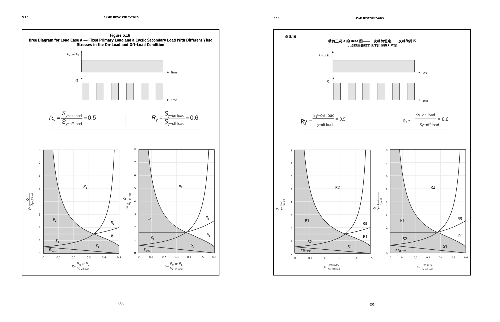
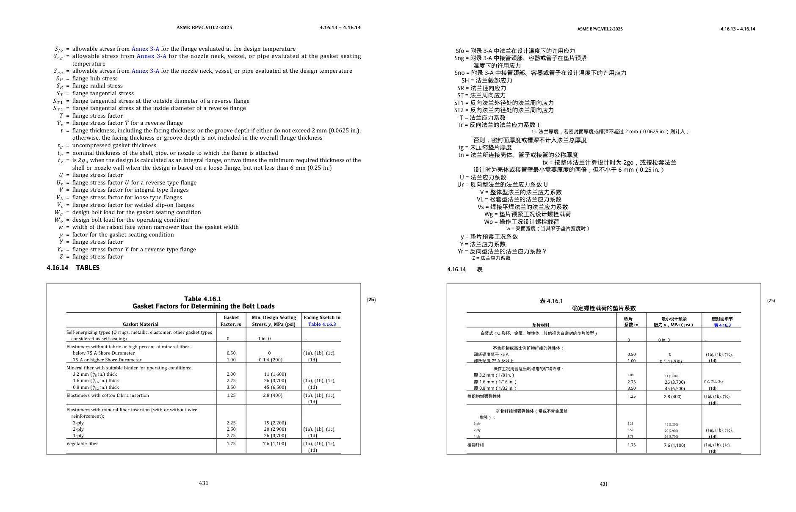
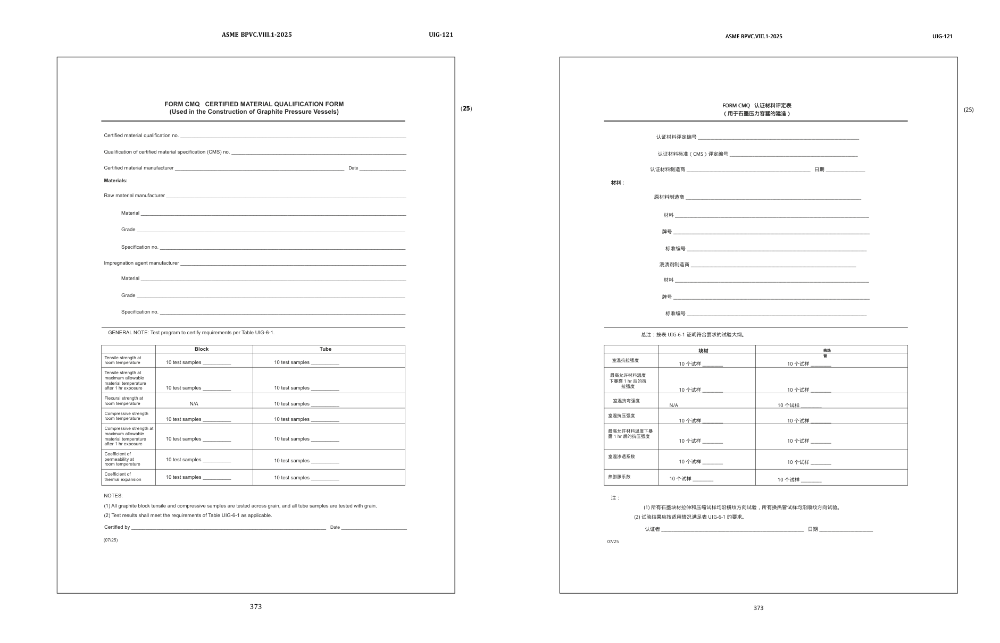
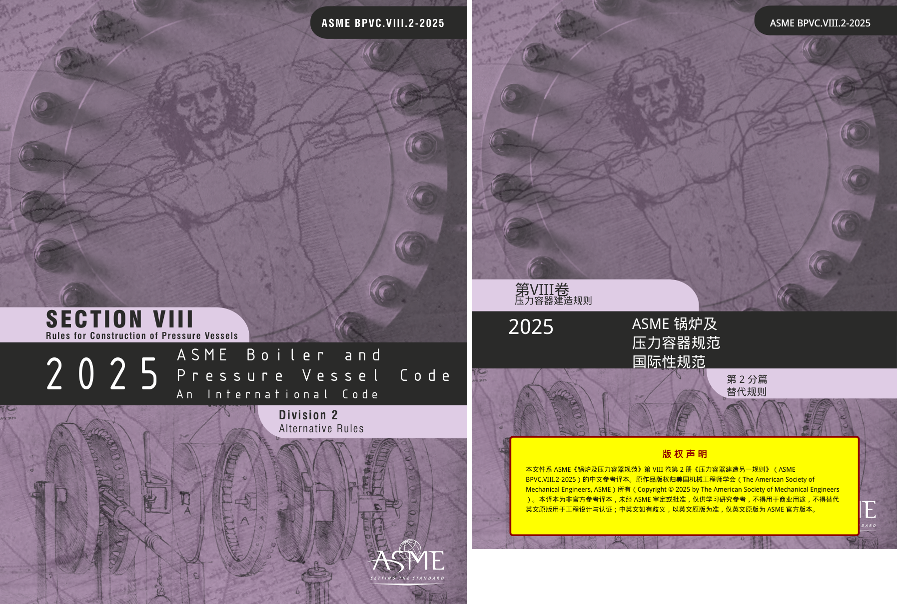
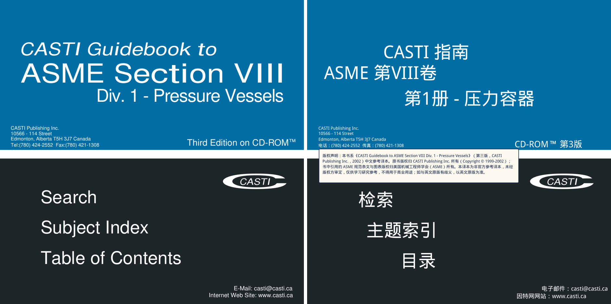
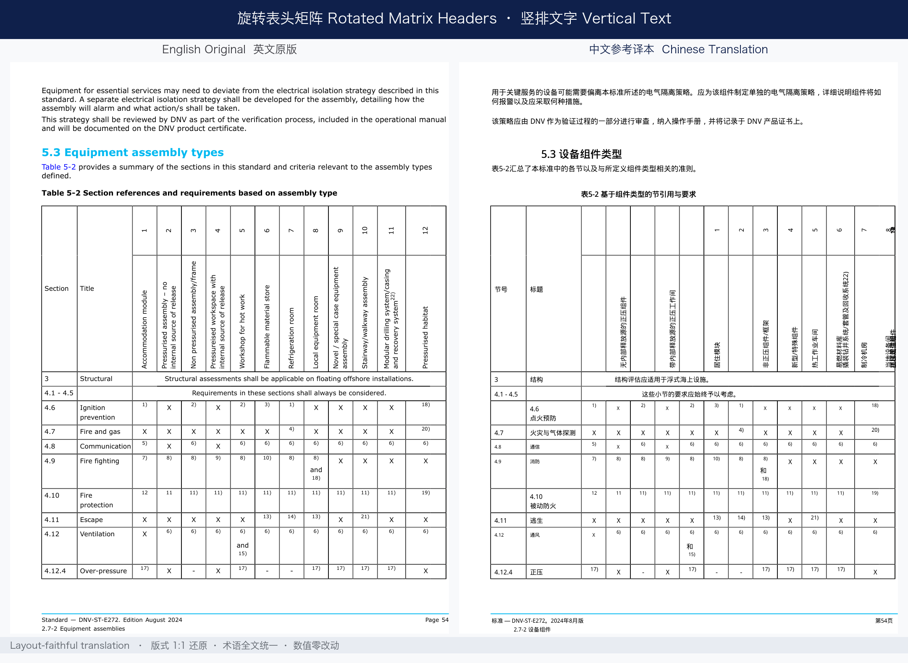
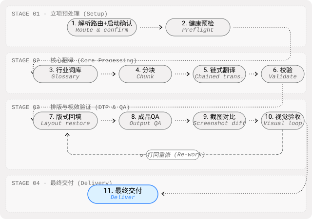

# pro-doc-translator · 专业文档翻译师

**Any-industry, any-format professional document translation for AI agents** — auto-builds domain glossaries, restores PDF layout 1:1, translates Office files in place, and ships with a four-fold QA + visual-acceptance loop. Works as a portable skill or as a plain prompt + toolkit with **any AI agent**, on **Windows / macOS / Linux**.

**任意行业、任意格式的专业文档翻译**：自动构建领域专业词汇表，PDF 1:1 版式还原，Office 原位翻译保格式，内置四重自动 QA 与视觉验收闭环。以可移植技能或「提示词 + 工具箱」形式适配**任何 AI agent**，支持 **Windows / macOS / Linux** 全平台。

   

---

## ✨ 截图预览 Screenshots

| 公式版式对比 Formula Layout | 大型表格对比 Dense Tables |
|---|---|
|  |  |

| 表单页对比 Stamped Forms | 版权声明亮黄醒目 Yellow Disclaimer |
|---|---|
|  |  |

| Logo 字形徽标保留 Glyph-logo Preserve | 旋转表头矩阵 Rotated Matrix |
|---|---|
|  |  |

> 左：英文原版 Left: English original · 右：中文参考译本 Right: Chinese translation。公式分式基线、垫片系数大表、表单字段、内嵌 Logo 字体徽标均 1:1 保留；版权声明为默认**亮黄醒目**样式（bright-yellow style）。

---

## 🎯 核心能力 Features

| | 中文 | English |
|---|---|---|
| 📖 | **任意领域词汇表自动构建**：领域判定 → 术语挖掘（词频/缩写/定义句式/表头）→ 权威查证（标准组织/术语审定机构/官方双语文件，逐条记录来源与置信级）→ 三层定稿（verified / consistent / keep-original） | **Auto domain glossary**: domain detection → term mining (n-gram, acronyms, definition patterns, table headers) → authoritative lookup (standards bodies, terminology councils, official bilingual docs, with sources & confidence) → 3-tier consolidation |
| 📐 | **PDF 1:1 版式还原**：TextWriter 度量一致绘制、表格列合并块行×列拆分、行级锚定、旋转表头、目录点线、封面免责声明 | **PDF 1:1 layout restore**: TextWriter metric-consistent drawing, row×column splitting of column-merged blocks, per-line anchoring, rotated headers, TOC dot leaders, cover disclaimer |
| 📁 | **多格式路由**：原生 PDF / 扫描 PDF(OCR) / DOCX / PPTX / XLSX / Markdown / 纯文本，Office 原位翻译保样式 | **Format routing**: native/scanned PDF, Office in-place translation preserving styles |
| 🔗 | **链式翻译流水线**：文档内块间串行共享实际译文衔接与术语决策日志，文档间并行 | **Chained pipelines**: serial within a document (real-translation handoff + term decision log), parallel across documents |
| ✅ | **四重自动 QA + 视觉验收**：完整性/术语漂移/残留源语言/表格覆盖率 + 越界/微字/页脚/叠印扫描 + 渲染页面逐页裁决闭环 | **Four-fold QA + visual acceptance**: completeness/terminology drift/source-language residue/table coverage + overflow/tiny-font/footer/overlap scans + rendered-page review loop |
| 🔁 | **无人值守**：全中间产物落盘、断点续跑、配额中断自动定时恢复 | **Unattended**: everything persisted, resumable, auto-retry timer on quota interruption |
| 🩺 | **PDF 健康预检**：开工前自动检测连字置换/悬挂CTM/CropBox错位/Logo字体徽标/水印候选四类地雷，按检出项执行修复策略 | **PDF preflight**: auto-detects ligature substitution, dangling CTM, CropBox mismatch, glyph-logo fonts, watermark candidates |
| 🏭 | **行业推断 + 全局词库**：从引用标准号/机构/缩写聚类推断行业（不确定时询问用户），词库按行业沉淀跨项目复用 | **Industry inference + global glossary**: infers industry from cited standards & org names (asks user when uncertain); glossaries persist per industry |
| 🧾 | **BUILD_FIX 声明式修复**：视觉验收 fail → 精确修复记录（保留徽标/封面分层/定点译文/水印去除），禁止启发式大改 | **BUILD_FIX registry**: every visual fail becomes a declarative fix record — no heuristic rewrites |
| 🖼️ | **截图对比验收**：复杂公式页与大型表格页自动挑选，中英并排 + 关键区域 200dpi 放大 | **Screenshot diff**: auto-picks formula/dense-table pages, side-by-side pairs + 200dpi zooms |
| 💧 | **去除必要的水印**：第三方水印（下载站/扫描件标记）只脱字不回填，去除项入构建摘要 | **Watermark removal**: third-party watermarks redacted (drop-only), logged in build summary |

## 📊 质量保证 Quality Assurance

术语漂移、占位符残留、微字、越界、叠印等指标以**基线对照 + 视觉验收闭环**量化管控；复杂公式页与大型表格页强制截图对比，数值与原版逐处核对。

Terminology drift, placeholder leaks, tiny text, overflow and overlap are controlled via baseline-diffed automated scans plus a visual-acceptance loop; formula and dense-table pages are mandatory screenshot-diff targets with value-by-value verification.

## ## 🚀 快速开始 Quick Start

### 方式一 · 作为可移植技能 Portable skill（支持 Agent Skills 规范的 agent）

遵循开放 `SKILL.md` 规范，适用于 Claude Code、ZCode 及其他支持该规范的 coding agent：

```bash
# macOS / Linux
git clone https://github.com/lixeon2046/pro-doc-translator.git ~/.agents/skills/pro-doc-translator
# Windows (PowerShell)
git clone https://github.com/lixeon2046/pro-doc-translator.git "$env:USERPROFILE\.agents\skills\pro-doc-translator"
```

各 agent 的技能目录不同（如 Claude Code 为 `~/.claude/skills/`）——把克隆目录放到你的 agent 对应位置即可。重启后直接说：

> “把 ./report.pdf 翻译成中文” / “Translate ./manual.docx to English”

### 方式二 · 任何 AI agent + 工具箱 Any agent + toolkit

不需要技能机制也能用：把 [`assets/task-prompt-template.md`](assets/task-prompt-template.md)（通用启动提示词）发给任意能读写文件、执行 Python 的 AI agent（Claude / GPT / GLM / Cursor / …），并让它使用 [`scripts/`](scripts/) 下的独立命令行工具。所有脚本仅依赖 `PyMuPDF`，全平台可运行：

```bash
pip install pymupdf
python scripts/extract_pdf.py ./report.pdf --workdir .work   # 1) 结构化提取
python scripts/chunk_safe.py report --workdir .work          # 2) 表感知安全分块
python scripts/engine_tw.py                                  # 3) TextWriter 版式回填（库调用）
python scripts/qa_scan.py ./report_zh.pdf --cjk-only         # 4) 成品扫描
```

完整工作流与各阶段规则见 [`SKILL.md`](SKILL.md) 与 [`references/`](references/)。

## 🏗️ 工作流 Workflow



> 交互式版本 Interactive version：[`docs/workflow.html`](docs/workflow.html) — 悬停任意节点可高亮其上游/下游链路。Hover a node to highlight its upstream/downstream chain.

| 脚本 Script | 用途 Purpose |
|---|---|
| `scripts/extract_pdf.py` | 结构化提取（行级几何/旋转/跨页表格检测）Structured extraction |
| `scripts/chunk_safe.py` | 表感知安全分块 Table-aware safe chunking |
| `scripts/canonical.py` | 高频重复文本规范译文表 Canonical recurring translations |
| `scripts/patch_columns.py` | 列合并块拆分 Column-merged block splitting |
| `scripts/engine_tw.py` | TextWriter 版式回填引擎 Layout restoration engine |
| `scripts/preflight_pdf.py` | PDF 健康预检（四类陷阱+水印候选）Health preflight |
| `scripts/build_doc.py` | 构建驱动（BUILD_FIX 声明式修复+免责声明）Build driver |
| `scripts/visual_diff.py` | 截图对比（中英并排+局部放大）Screenshot diff |
| `scripts/validate_trans.py` / `qa_scan.py` / `tables_coverage.py` | QA 套件 QA suite |

方法论文档：[`references/`](references/)（词汇表构建协议 / PDF 引擎规范 / Office 路线 / QA 协议）

## ⚠️ 免责声明 Disclaimer

本工具用于翻译你拥有合法使用权的文档。原文档的版权归属其发布机构；译文仅供参考，任何技术要求的解读与执行均须以官方原版文件为准。本仓库不包含任何受版权保护的文档内容。

Use this tool only on documents you are legally entitled to translate. Copyright of source documents remains with their publishers. Translations are for reference only. This repository contains no copyrighted document content.

## 📄 许可证 License

[MIT](LICENSE) © 2026 lixeon2046
